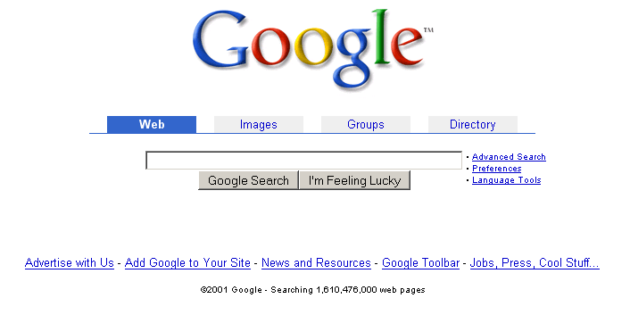
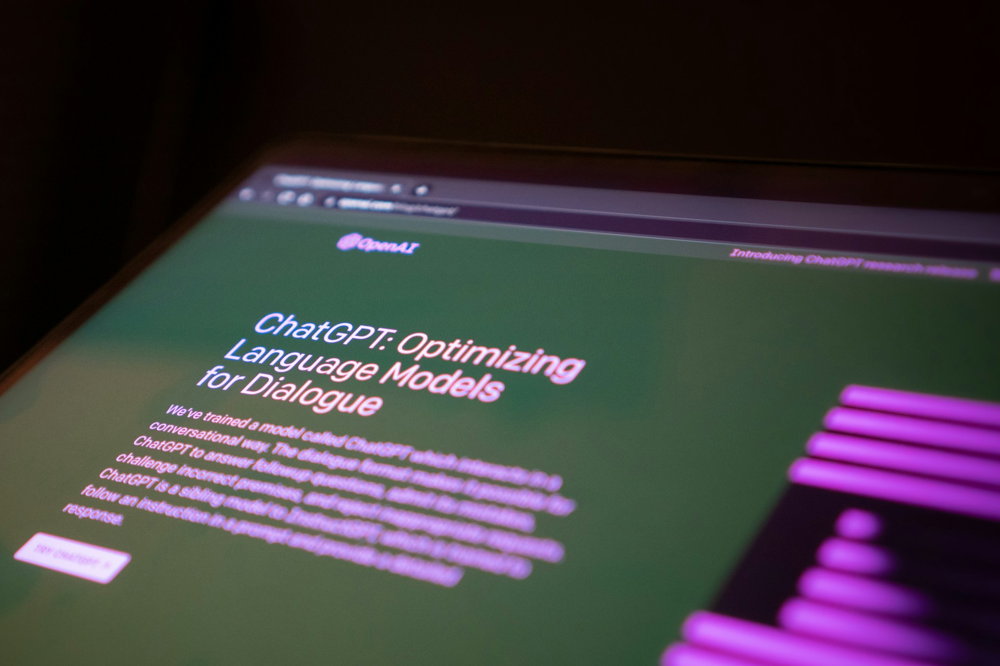
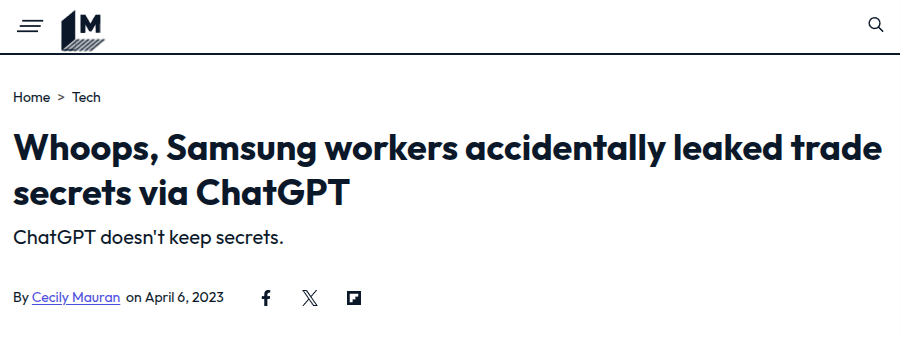
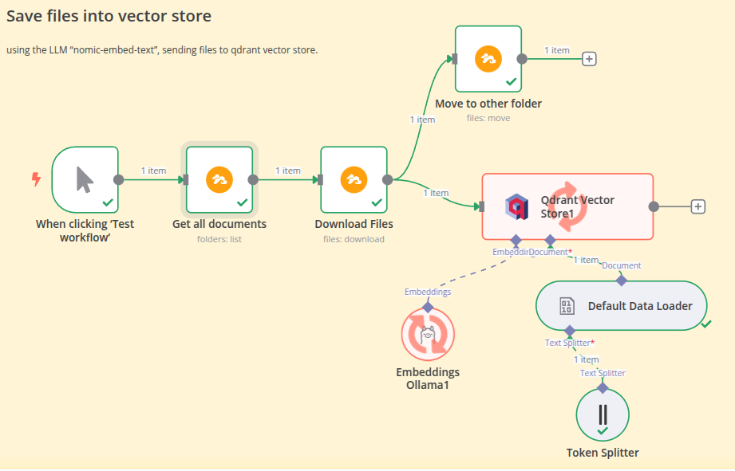
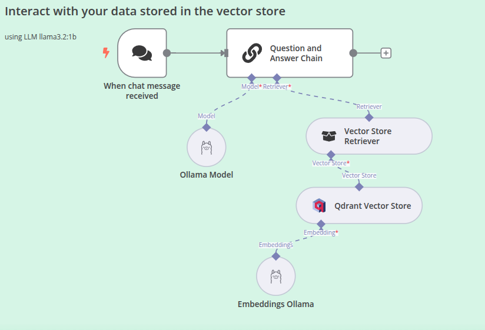
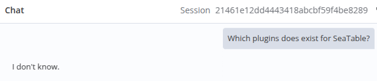
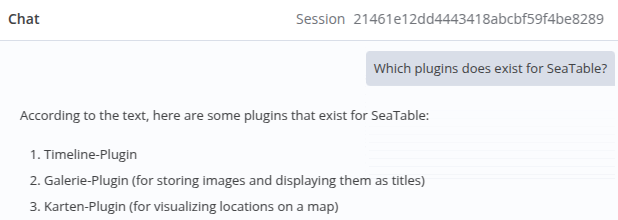

<!-- Mgmt Summary:

AI has revolutionized how we access public knowledge, from Google Search to ChatGPT. However, these tools can't be safely used with confidential data, as demonstrated by recent incidents. 

This presentation introduces a solution: AI-powered private knowledge management systems. Using open-source tools, organizations can create secure, local AI chatbots that interact with their proprietary data. 

This approach offers enhanced information retrieval and analysis while maintaining data privacy. The presentation concludes with a live demo and discusses potential challenges and future implications for corporate knowledge management.
-->

<!-- _class: first -->
<!-- _footer: '' -->

# AI-Powered File / Knowledge Management

Christoph Dyllick-Brenzinger
March 21th, 2025, LMU München

---

<!-- _class: "scoped" -->
<!-- _header: "Short historical overview" -->

# How do we search for information?

---

<!-- In ancient times, it required people to travel and to tell, to share knowledge. I took this picture of the alps, but in ancient times it was a huge barrier for knowledge... -->

<!-- header: "" -->

---

<!-- Then the letterpresschanged changed how we saved and shared knowledge. Now it was possible to persist information. -->

---

<!-- What a revoluation when Google published its search engine: The simplest way to search for public information, the world's knowledge at our fingertips -->

---

<!-- ChatGPT (Launched in November 2022) represents a paradigm shift in how we access and interact with information. While Google Search provides a list of relevant links, ChatGPT offers a conversational interface that allows users to engage directly with knowledge. This AI-powered tool not only retrieves information but also synthesizes it, providing detailed summaries, drawing correlations, and maintaining context across multiple queries. -->

---

<cite>What a groundbreaking revolution in how we access knowledge!</cite>

---

<!-- _class: "scoped" -->
<!-- _header: "" -->

# But there is one problem!

---

<!-- While advanced technologies like Google Search and ChatGPT have revolutionized access to public knowledge, they cannot provide insights into confidential institutional data. This limitation often results in a disparity between the effectiveness of public information retrieval and internal knowledge work within organizations. -->

<!-- _header: "AI Powered File / Knowledge Management" -->

<cite>These search evolution happened only for public knowledge!</cite>

---

<!-- So, some clever guys tried to use AI with their secret data, but it didn't quite work out as planned. Samsung employees ended up leaking their secret trade data to ChatGPT. It was a bad idea, and it highlights the risks of using AI tools with sensitive information. -->

---

<!-- The most important question is: why can't we limit the answers of an AI to private data without leaking it? -->

<!-- _header: "The most important question" -->

<cite>
Can't we use AI to interact with private data?!?
</cite>

---

<!-- I will show you how easy it is. I will create our own ai powered chat bot that we can interact with our private data. -->

<!-- _class: "scoped" -->
<!-- _header: "" -->

# Let's interact with our private data via AI!

---

<!-- Imagine the use cases ... -->
<!-- header: "AI-powered file / knowledge management" -->

# Potential Use Cases

# Differences between base and app?

  #### Medical Practice

  - What medications has Patient X received so far?
  - What other threatments might help?

  #### University

  - Where are there overlaps or synergies between different research projects?

  #### Software Company

  - What help articles do we need to avoid the most common support requests?

---

# The setup

#### Self-hosted n8n AI Starter Kit from <i class="fa-brands fa-github"></i> including:

- n8n (workflow automation)
- Ollama (LLM platform)
- Qdrant (vector store)

---

# My Workflow

  #### Data Ingestion / Indexing
   
  - Read and preprocess documents
  - Convert content to embeddings
  - Store in Qdrant

  
  #### Retrieval-Augmented Generation (RAG)
  - Retrieve relevant context
  - Augment chatbot's knowledge
  - Generate informed responses

---

<!-- _class: "scoped" -->
<!-- _header: "" -->

# Live-Demo

---

<!-- sounds complicated, requires a lot of ressources and don't we need an llm? -->

<!-- header: "AI-powered file / knowledge management" -->

# Short Recap

- Creation of a private, personal knowledge base
- Using AI power to interact with this knowledge
- 100% private, running locally

---

# Challenges

- Data Privacy: Keeping everything local
- Accuracy: Careful curation of knowledge base
- Scalability: Efficient indexing and retrieval
- Madness: Prevent AI to invent new content

---

# My prediction of the near future

- Companies will build local AI-powered knowledge management systems.
- AI will index and process local knowledge from files.
- Employees will interact via chatbots.
- This enhances access to company-specific information.
- It represents a significant shift in knowledge management.

---

<!-- speaker notes
Ladies and Gentlemen,
we've seen how AI-powered knowledge management can transform the way we interact with our data. It's not just for tech giants - it's accessible, powerful, and ready for you to use."

I encourage you to explore this technology. The Self-Hosted AI Starter Kit is available on GitHub. Start small, experiment, and see how it can enhance your work. 

Thank you, and I'm happy to take any questions."
-->

# Interested in this presentation?

- online: https://christophdb.github.io/ai-powered-file-management/.
- pdf: https://github.com/christophdb/ai-powered-file-management/blob/main/Slides.pdf

---

<!-- _class: "scoped" -->
<!-- _header: "AI-powered file / knowledge management" -->

# Backup Slides

---

<!-- header: "" -->

---

---

# Answer of chatbot without information

no guessing, no invention of content. GREAT!

---

# Answer of the chatbot after providing some information

